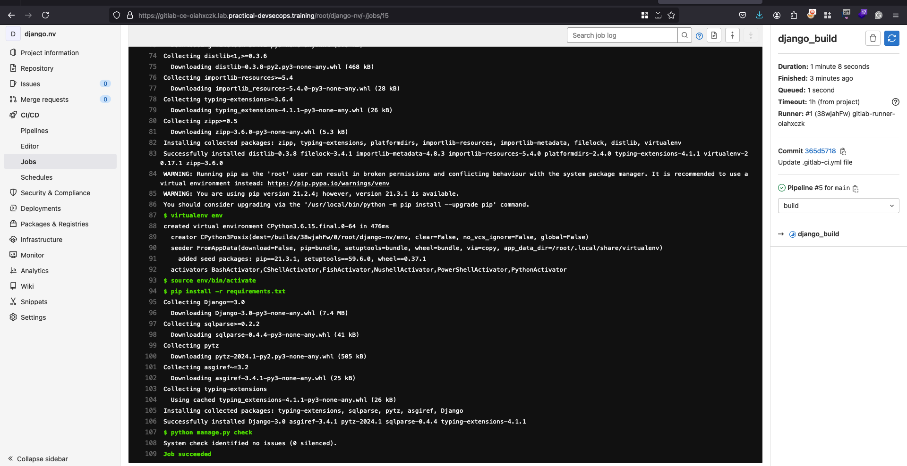
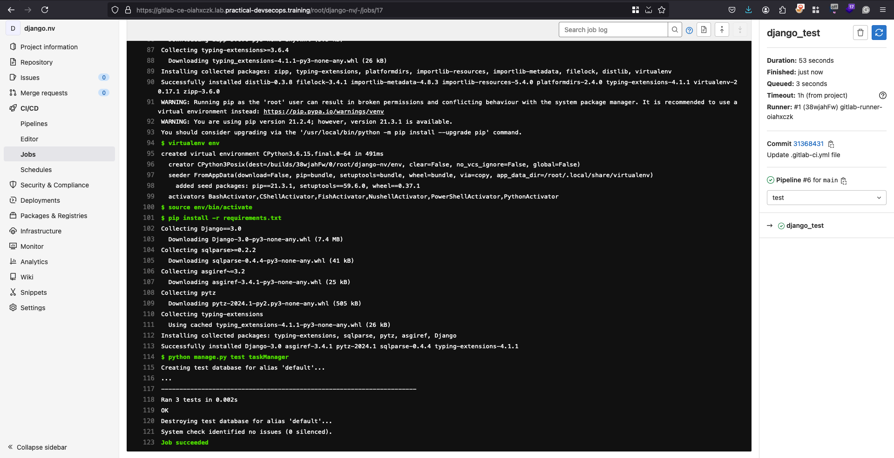
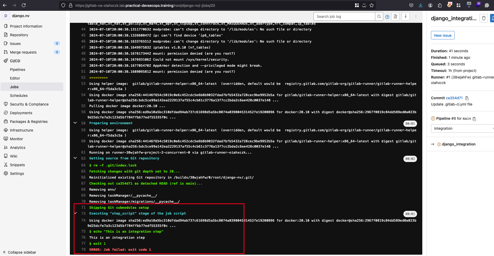

# Stages in CI/CD Pipeline

| Stage       | Description                                                                 |
|-------------|-----------------------------------------------------------------------------|
| Build       | The code is compiled.                                                       |
| Test        | The code is rigorously tested.                                              |
| Integration | The tested code is integrated, ensuring it works harmoniously with existing systems. |
| Deploy      | The code is rolled out to production environments.                          |

**Note:** The configuration of stages may vary across different CI/CD systems (such as GitLab, GitHub, Jenkins, CircleCI, etc).

## Build Stage

**Description:**
The build stage is the first stage of the pipeline. The process results in a runnable instance of the software, often referred to as a build, and ensures that the codebase can be turned into a working application.

**Note:**
- The build process ensures that the code compiles without errors so that it runs smoothly during deployment.
- Sometimes, this process includes building a Docker image of your application.

**Example .gitlab-ci.yml File:**

```yaml
image: docker:20.10

services:
  - docker:dind

stages:
  - build

django_build:
  stage: build
  image: python:3.6
  before_script:
   - pip3 install --upgrade virtualenv
  script:
   - virtualenv env
   - source env/bin/activate
   - pip install -r requirements.txt
   - python manage.py check
```

**Explanation:**
- **image:** Specifies the Docker image to use.
- **services:** Defines the services required for the build (e.g., Docker in Docker).
- **stages:** Defines the stages of the pipeline (starting with build).
- **django_build:** 
  - **stage:** Indicates this job belongs to the build stage.
  - **image:** Specifies the Docker image to use for this job.
  - **before_script:** Commands to run before the main script.
  - **script:** Main commands to run during this stage.

**Steps to Implement:**

1. Open the URL: [GitLab CI File](https://gitlab-ce-oiahxczk.lab.practical-devsecops.training/root/django-nv/-/blob/main/.gitlab-ci.yml).
2. Replace the content with the provided script.
3. The initial step tests whether the application’s build condition can meet the expected outcome.
4. The last command, `python manage.py check`, verifies the application’s functionality.
5. As soon as a change is made to the repository, the pipeline starts executing the jobs.
6. Visit [Pipeline Results](https://gitlab-ce-oiahxczk.lab.practical-devsecops.training/root/django-nv/pipelines) to see the output. Click on the `django_build` job name to see the successful build output.

**Output of Pipeline log:**




### Test Stage

**Description:**
In the test stage, automated tests are run against the build. These tests ensure that new changes don’t break any existing functionality and meet the required quality standards. Tests can range from unit tests, integration tests, to end-to-end tests.

**Script for Test Stage:**
```yaml
django_test:
  stage: test
  image: python:3.6
  before_script:
   - pip3 install --upgrade virtualenv
  script:
   - virtualenv env
   - source env/bin/activate
   - pip install -r requirements.txt
   - python manage.py test taskManager
```

**Full `.gitlab-ci.yml` Script:**
```yaml
image: docker:20.10

services:
  - docker:dind

stages:
  - build
  - test

django_build:
  stage: build
  image: python:3.6
  before_script:
   - pip3 install --upgrade virtualenv
  script:
   - virtualenv env
   - source env/bin/activate
   - pip install -r requirements.txt
   - python manage.py check

django_test:
  stage: test
  image: python:3.6
  before_script:
   - pip3 install --upgrade virtualenv
  script:
   - virtualenv env
   - source env/bin/activate
   - pip install -r requirements.txt
   - python manage.py test taskManager
```

**Explanation:**

- **Test Stage:** Ensures the application is tested thoroughly.
- **django_test:** 
  - **stage:** Indicates this job belongs to the test stage.
  - **image:** Specifies the Docker image to use for this job.
  - **before_script:** Commands to run before the main script.
  - **script:** Main commands to run tests.

**Steps to Implement:**

1. Add the `django_test` script to the end of the `.gitlab-ci.yml` file.
2. This stage tests the application to ensure it runs as expected with no issues.
3. As soon as a change is made to the repository, the pipeline starts executing the jobs.
4. Visit [Pipeline Results](https://gitlab-ce-oiahxczk.lab.practical-devsecops.training/root/django-nv/pipelines) to see the output. Click on the `django_test` job name to see the successful test output.

**Execution of test build:**



## Integration Stage

**Description:**
The integration stage combines and validates the functionality of new code with existing code or services. This process involves merging code branches and ensuring that the integrated system functions correctly. It could also involve deploying the application to a staging environment for further integration and user acceptance tests.

**Script for Integration Stage:**
```yaml
django_integration:
  stage: integration
  script:
    - echo "This is an integration step"
    - exit 1
  allow_failure: true # Even if the job fails, continue to the next stages
```

**Full `.gitlab-ci.yml` Script:**
```yaml
image: docker:20.10

services:
  - docker:dind

stages:
  - build
  - test
  - integration

django_build:
  stage: build
  image: python:3.6
  before_script:
   - pip3 install --upgrade virtualenv
  script:
   - virtualenv env
   - source env/bin/activate
   - pip install -r requirements.txt
   - python manage.py check

django_test:
  stage: test
  image: python:3.6
  before_script:
   - pip3 install --upgrade virtualenv
  script:
   - virtualenv env
   - source env/bin/activate
   - pip install -r requirements.txt
   - python manage.py test taskManager

django_integration:
  stage: integration
  script:
    - echo "This is an integration step"
    - exit 1
  allow_failure: true # Even if the job fails, continue to the next stages
```

**Explanation:**

- **Integration Stage:** Validates new code with existing code or services.
- **django_integration:** 
  - **stage:** Indicates this job belongs to the integration stage.
  - **script:** Commands to run during this stage.
  - **allow_failure:** Allows the pipeline to continue even if this job fails.

**Steps to Implement:**

1. Add the `django_integration` script to the end of the `.gitlab-ci.yml` file.
2. This stage integrates and validates the new code.
3. As soon as a change is made to the repository, the pipeline starts executing the jobs.
4. Visit [Pipeline Results](https://gitlab-ce-oiahxczk.lab.practical-devsecops.training/root/django-nv/pipelines) to see the output. Click on the `django_integration` job name to see the output.
5. The `allow_failure: true` option ensures that even if the job fails, the pipeline will continue to the next stages.

**Execution of integration build:**



## Deploy Stage

**Description:**
The deploy stage marks the transition of an application from development or testing environments to production. It is essential for releasing new features or bug fixes and employs various deployment strategies to minimize disruptions.

**Script for Deploy Stage:**
```yaml
django_deployment:
  stage: deploy
  script:
    - echo "This is a deploy step."
  when: manual # Continuous Delivery
```

**Full `.gitlab-ci.yml` Script:**
```yaml
image: docker:20.10

services:
  - docker:dind

stages:
  - build
  - test
  - integration
  - deploy

django_build:
  stage: build
  image: python:3.6
  before_script:
   - pip3 install --upgrade virtualenv
  script:
   - virtualenv env
   - source env/bin/activate
   - pip install -r requirements.txt
   - python manage.py check

django_test:
  stage: test
  image: python:3.6
  before_script:
   - pip3 install --upgrade virtualenv
  script:
   - virtualenv env
   - source env/bin/activate
   - pip install -r requirements.txt
   - python manage.py test taskManager

django_integration:
  stage: integration
  script:
    - echo "This is an integration step"
    - exit 1
  allow_failure: true # Even if the job fails, continue to the next stages

django_deployment:
  stage: deploy
  script:
    - echo "This is a deploy step."
  when: manual # Continuous Delivery
```

**Explanation:**
- **Deploy Stage:** Responsible for delivering the code to various environments (development, staging, production).
- **django_deployment:** 
  - **stage:** Indicates this job belongs to the deploy stage.
  - **script:** Commands to run during this stage.
  - **when: manual:** Ensures the job runs on a manual basis, preventing automatic execution.

**Steps to Implement:**
1. Add the `django_deployment` script to the end of the `.gitlab-ci.yml` file.
2. This stage deploys the application, marking the transition to production.
3. As soon as a change is made to the repository, the pipeline starts executing the jobs.
4. Visit [Pipeline Results](https://gitlab-ce-oiahxczk.lab.practical-devsecops.training/root/django-nv/pipelines) to see the output. Click on the `django_deployment` job name to see the output.
5. The `when: manual` attribute ensures the deploy job waits for user input before executing, allowing for controlled deployments.

# Summary 

| Stage       | Description                                                                 |
|-------------|-----------------------------------------------------------------------------|
| Build       | Initial code compilation, preparing it for further testing.                 |
| Test        | Thorough testing to identify and resolve issues, ensuring software quality. |
| Integration | Combining software with other systems to verify compatibility and functionality. |
| Deploy      | Releasing software to production environments, making it accessible to users. |

# Additional References

- [Stages of a CI/CD Pipeline](https://dev.to/pavanbelagatti/stages-of-a-cicd-pipeline-2bmp)
- [CI/CD pipelines](https://docs.gitlab.com/ee/ci/pipelines/)
- [The stages of a CI/CD Pipeline easily explained](https://www.linkedin.com/pulse/stages-cicd-pipeline-easily-explained-andrea-de-rinaldis/)