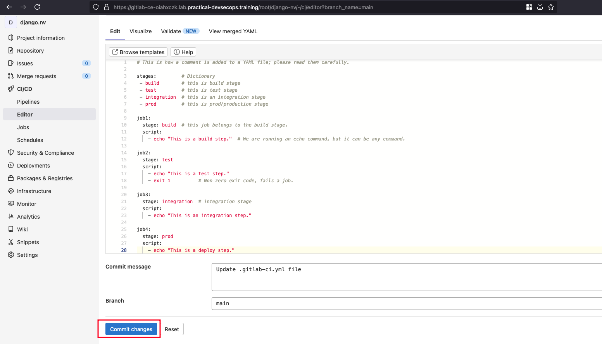
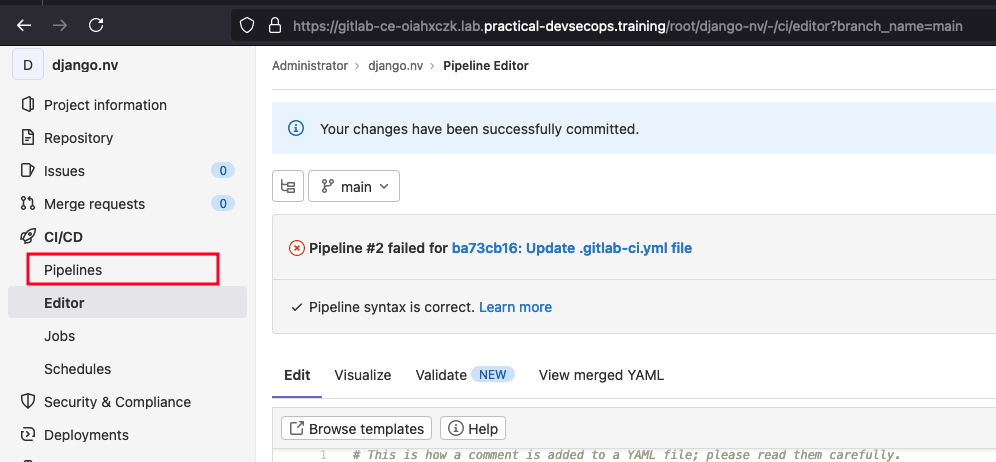
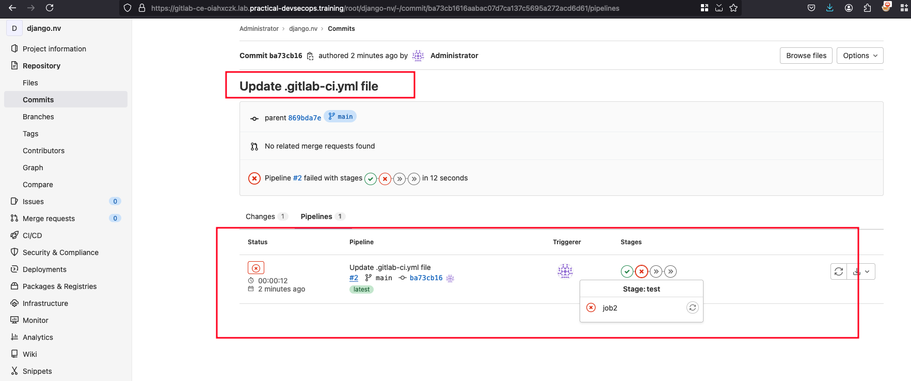

# YAML Syntax

## Definition
- YAML (YAML Ain’t Markup Language) is a human-readable data serialization language.
- Commonly used for configuration files and applications where data is stored or transmitted.

## Key Points
- YAML is easier for humans to read and write compared to XML or JSON.
- Used in CI/CD systems, Infrastructure as Code tools, Kubernetes, etc.
- YAML files start with optional three dashes (`---`).

## Example

```yaml
---
# A list of gadgets
- Sony
- LG
- Apple
- Samsung
```

## List Concept
- Optional dashes in Ansible scripts, but not enforced in `.gitlab-ci.yml`.

```yaml
stages:
 - build
 - test
 - integration
 - prod
```

## Dictionaries (key/value pairs)
- Represented as `key: value` (colon followed by a space).

```yaml
stage: test
image: node:alpine3.10
script: echo "hello world"
```

## Nested Dictionaries and Lists
```yaml
test:
  stage: test
  script:
    - echo "This is a test step."
    - exit 1
```

## Example GitLab CI/CD Pipeline
```yaml
# Comment

stages:
 - build
 - test
 - integration
 - prod

job1:
  stage: build
  script:
    - echo "This is a build step."

job2:
  stage: test
  script:
    - echo "This is a test step."
    - exit 1

job3:
  stage: integration
  script:
    - echo "This is an integration step."

job4:
  stage: prod
  script:
    - echo "This is a deploy step."
```

## Notes
- `stages:` defines the pipeline flow.
- `job1`, `job2`, etc., define individual jobs with their respective stages and scripts.
- Comments are added with `#`.

# Run a simple CI/CD pipeline

We have already provided with credentials where you can login with `root` as username and password as `pdso-training`

## Editing the .gitlab-ci.yml 

In the `django-nv` we will the contents of `.gitlab-ci.yml` with the following content 

```yml
# This is how a comment is added to a YAML file; please read them carefully.

stages:         # Dictionary
 - build        # this is build stage
 - test         # this is test stage
 - integration  # this is an integration stage
 - prod         # this is prod/production stage

job1:
  stage: build  # this job belongs to the build stage.
  script:
    - echo "This is a build step."  # We are running an echo command, but it can be any command.

job2:
  stage: test
  script:
    - echo "This is a test step."
    - exit 1          # Non zero exit code, fails a job.

job3:          
  stage: integration  # integration stage
  script:
    - echo "This is an integration step."

job4:
  stage: prod
  script:
    - echo "This is a deploy step."
```

After pasting, we can click on the `Commit changes`



Then we can go to the pipelines under CI/CD where you can check out on how the jobs are running and their status 



Checking the pipeline status which is failed in stage2 under job2 due to fact that we have provided the non zero exit status code and that's the reason it is failed 



## Challenges 

### Create five stages namely build, test, integration, staging, and prod

```yml
stages:         # Dictionary
 - build        # build stage
 - test         # test stage
 - integration  # integration stage
 - prod         # Production stage
 - staging       # staging stage
```

### Create jobs with job names as build, test, integration, staging, and prod (you can make use of simple echo commands under the script tag, as seen in the previous step) under the respective stages (build job under build stage, test job under test stage, and so on)

```yml
job1:
  stage: build  # this job belongs to the build stage.
  script:
    - echo "This is a build step."  # We are running an echo command, but it can be any command.

job2:
  stage: test
  script:
    - echo "This is a test step."         # Non zero exit code, fails a job.

job3:          
  stage: integration  # integration stage
  script:
    - echo "This is an integration step."

job4:
  stage: prod
  script:
    - echo "This is a deploy step."

job5:
  stage: staging
  script:
    - echo "This is a deploy step."
```